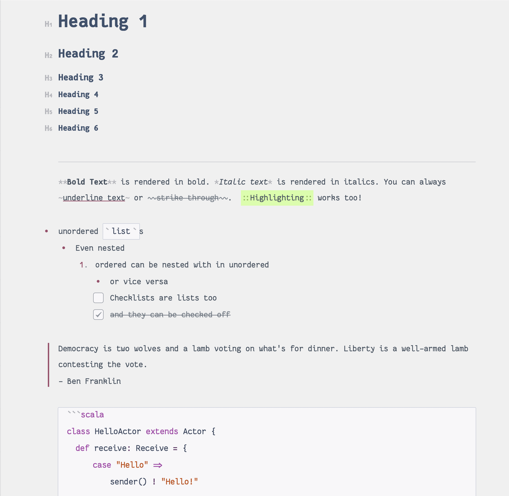

# Bear Custom Font

Bear does not support custom fonts yet. However, you can replace any default fonts with a custom one by swapping its `.theme` files.

The provided [Menlo.theme](./Menlo.theme) file replaces the default Menlo font with [Fantasque Sans Mono](https://github.com/belluzj/fantasque-sans)

## How to Install

- Make sure you have [Fantasque Sans Mono](https://github.com/belluzj/fantasque-sans) installed. If not, install it using Homebrew `brew install --cask font-fantasque-sans-mono` 
- Run `install.sh` script to copy the theme resource. The script takes a backup of the original file. 

**Note**: You will need to re-install after every update. 